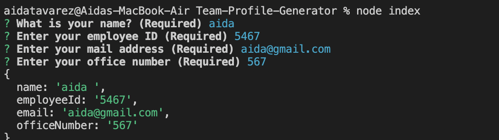
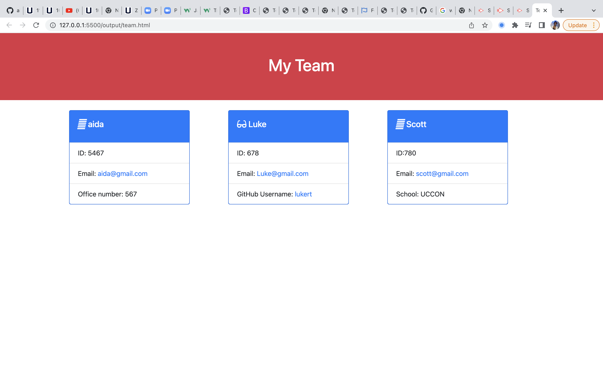

# Team-Profile-Generator

## Description 
This application was built with  Node.js, it is a command line application that takes in information about employees on a software engineering team and generates an HTML webpage that displays summaries for each person.

  # Table of Content)
  - [Installation](#Installation)
  - [Usage](#Usage)
  - [Websites](#Websites)
  - [Profile](#Profile)

  ## Installation 
  To generate your HTLM page, ``` git clone ``` the repo down to your local so you have the Node project on your local.

Run npm install in order to install the following npm package dependencies as specified in the package.json:
        * inquirer will prompt you for your inputs from the command line.
        *jest for running the unit tests

The application will start by running   ```node index.js``` in the command line.




Answer the prompts in your command line to generate the HTML page.

After answering all the prompts, your HTML file will be in the named 'team.html' and will be ready for you in a folder call output.

## Usage 

When you run ```node index.js``` , the application uses the inquirer package to prompt you in the command line with a series of questions about your team members

After you answer all the questions open the team.html file in your computer and you'll be presented with a page like this one


## Websites

*[Gihub Repository](https://github.com/aidyel/Team-Profile-Generator)

*[Vide0 demonstration](https://drive.google.com/file/d/1SZXc7pSoheRPePSiVxh02e_iDObq13kb/view)